```{r setup, include=FALSE, message = FALSE}
options(scipen = 0, digits = 3)  # controls number of significant digits printed
library(tidyverse)
library(kableExtra)
```

\bigskip

The code to reproduce this report is available *[on Github](https://github.com/lucacurran/data-mining-final-project).*

\newpage

# Executive Summary

**Problem.** Increasingly, the impact of external socioeconomic factors on individual opportunity and livelihood is being examined. Holistic college admissions processes aim to contextualize each applicant's success in order to provide insight into the relative accomplishments of each applicant. Their belief is that success ought to be measured in context with ones socioeconomic circumstances given opportunity access is both meaningful and unequal. Community factors affecting individual healthcare expenses also influence individual economic opportunities.

Accurately predicting future healthcare costs among the medicare-fee-for-service group, those sixty-five or older or suffering from disability and the group with the largest total healthcare-related expenditures annually, will be critical to efficiently target government aid resources. Hence, for our final project we decided to examine various communal socioeconomic factors that affect healthcare cost per capita among this high healthcare-expense group. Analyzing data from the 2020 general presidential election,  county-wide health and socioeconomic statistics, and per capita healthcare-related expenditures, we examined which communal socioeconomic and political features best predict greater healthcare spending per capita.

**Data.** Our dataset pulled from four sources: the United States Centers for Medicare and Medicaid Services (CMS), the Massachusetts Institute of Technology (MIT) Election Data and Science Lab, the University of Wisconsin (UW) Population Health Institute County Health Rankings & Roadmaps, and US Census Bureau (Census) data. Our primary response variable, `per capita health costs` came from the CMS dataset. `Per capita health cost` is defined as the total individual cost of all healthcare-related expenses (out-of-pocket medical services, insurance premiums, personal healthcare goods and services) for the medicare fee-for-service population in USD. This data is from 2019: the most recent data available. The explanatory variables, ranging from `party` (political affiliation of the winning 2020 general presidential candidate in that county) to `household has broadband` (percent of households that have broadband internet subscription), are pulled from the MIT, UW, and Census datatsets. These datasets are primarily from 2020 and 2019. Best attempts were made to use the most up-to-date data where possible.

**Analysis.** Before exploring our data or running any analyses, we split our data into a training dataset and a test dataset. The test dataset was reserved for assessing and comparing model performance. Following this step, we explored our data, looking at the overall distribution of `per capita health cost,` feature correlation, county presidential election support affect on our response, and the five counties with the highest and lowest `per capita health cost`. From there, we built five predictive models: ordinary least squares, ridge regression, LASSO regression, random forest, and boosting. Boosting had the lowest test RMSE of the tree-based methods, however, OLS had the lowest test RMSE overall.

**Conclusions.** Variables including the rate of hospital stays for ambulatory-care sensitive conditions per 100,000 Medicare enrollees (`preventable_hospitalization`), the percentage of workers who commute alone to work more thirty minutes (`long_commute_perc`), and the percentage of households that spend 50% or more of their household income on housing (`severe_ownership_cost`) were the most robust predictors of high `per capita health cost` across counties. Hopefully, this knowledge can be used to more efficiently target government spending on medicare, inform individual's healthcare plan purchases, and optimize the planning of healthcare insurance businesses. 

# Introduction

**Background.** Given the necessity of healthcare, its high cost, and varying economic ideologies, policies directed toward reducing the financial burden of healthcare-related expenses remain highly disputed here in the United States. Both Democrat and Republican voters viewed healthcare as their top priority heading into the 2020 presidential election.^[Adam Cancryn, 'Politico-Harvard Poll: Health care costs are top priority heading into elections,' *Politico*, 2020. https://www.politico.com/news/2020/02/19/poll-health-care-election-115866] This is no surprise given the cost of healthcare in the United States is substantially higher than in other countries.^[Kamal & Ramirez, Cox, 'How does health spending in the U.S. compare to other countries?' *Peterson KFF*, 2020. https://www.healthsystemtracker.org/chart-collection/health-spending-u-s-compare-countries/]
Within US borders, however, the cost of healthcare also varies. Past studies examining the social-determinants of health show that variation in healthcare costs can be attributed to a host of socioeconomic variables. The COVID-19 pandemic has further exposed inequalities in healthcare access. Key stakeholders in efforts to manage healthcare costs include health insurers, employers, patients, and government agencies.^[Sylvia Burwell, 'Setting Value-Based Payment Goals — HHS Efforts to Improve U.S. Health Care,' *NHS*, 2015. https://canceradvocacy.org/wp-content/uploads/2015/03/Burwell-NEJM-Value-Based-Payment-Goals.pdf] For health insurers, accurate cost forecasts can help with general business planning in addition to prioritizing the allocation of scarce care management resources. The same can be said for government agencies. Moreover, for patients, knowing in advance their likely expenditures for the next year could potentially allow them to choose insurance plans with appropriate deductibles and premiums, ultimately removing some of the financial burden. Accurately predicting future healthcare costs among the medicare-fee-for-service group, those 65+ or suffering from disability and the group with the largest total healthcare-related expenditures annually, will be critical to efficiently target government aid resources, optimize business efforts, and save patients money.

**Analysis goals.** Given the capacity for a variety of factors to influence individual healthcare spending across counties, we sought to investigate how per capita healthcare costs are affected by various socioeconomic factors. Specifically, we were interested in which variables of interest (e.g. flu vaccine rates, political support, median income, etc.) best predict individual healthcare costs (i.e. per capita health cost).

**Significance.** Our hope is that this analysis will add to the tremendous amount of research examining the social-determinants of health and vast inequalities in access to affordable healthcare exposed by the current pandemic. Accurately predicting the cost of healthcare will result in improved allocation of government and non-profit resources designated to assist the medicare-fee-for-service population and others burdened by significant healthcare expenses.

# Data

## Data sources

Our dataset merged four sources: the United States Centers for Medicare and Medicaid Services (CMS), the Massachusetts Institute of Technology (MIT) Election Data and Science Lab, the University of Wisconsin (UW) Population Health Institute County Health Rankings & Roadmaps, and the United States Department of Agriculture in conjunction with the United States Census Bureau (Census).

The data containing per capita health expenses by county was pulled from the United States Centers for Medicare and Medicaid Services (CMS). The CMS maintains various public use files that enable researchers and policymakers to evaluate trends in healthcare utilization and spending by geography for the medicare-fee-for-service population.^[Centers for Medicare and Medicaid Services: https://www.cms.gov/Research-Statistics-Data-and-Systems/Statistics-Trends-and-Reports/Medicare-Geographic-Variation/GV_PUF] The specific file we extracted data from contains county-level entries from 2007-2019. Only per capita health cost data from 2019 was examined. Given many of the other features were irrelevant in this study or were repeated in the county socioeconomic and health or demographic data all other data from this set was ignored.

The MIT Election Data and Science Lab exists to support advances in election science by collecting, analyzing, and sharing core data and findings.^[MIT Election Data and Science Lab: https://electionlab.mit.edu/about] The aforementioned data provided by MIT contains numerous variables specific to the county-level including total voter count, votes per candidate, as well as each candidate's political party affiliation. Only the most recent data was utilized in our examination: the 2020 general presidential election. The major political party affiliation of each winning candidate was considered instead of their name.

The UW data is a compilation of numerous data sources provided as part of the County Health Rankings & Roadmaps program. This University of Wisconsin program serves to promote health equity.^[University of Wisconsin Population Health Institute: https://www.countyhealthrankings.org/about-us] Their aim is to build awareness of the multiple factors that influence health. Our aim was to utilize the various socioeconomic, health, environmental, and clinical care data to inform our models. To do this, data from 2019 and earlier was utilized to create a broader understanding of each county. Of course, then an underlying assumption of our report is that this data changes relatively little year to year and has not been greatly impacted by the COVID-19 pandemic. Future analyses should aim to more consistently include up-to-date information. Explanatory variables that also appeared in the Census data were ignored and instead the corresponding variable was examined from the Census data.

The mission of the Census Bureau is to serve as the nation’s leading provider of quality data about the people and the economy of the United States. It operates under Title 13 and Title 26 of the U.S. Code.^[US Census Bureau: https://www.census.gov/about/what.html] This dataset, initially complied by the US Department of Agriculture, provides relevant census-gathered information for each county. Data contained in this dataset concerning measures taken prior to 2019 were ignored. Only variables with complete measurements for each observations were considered. 

## Data cleaning

Prior to merging the four datasets by FIPS, each dataset was individually tidied. First, all county socioeconomic data from UW was converted to lowercase and explanatory variables repeated in the Census data were removed. Next, variables utilized from the CMS data were renamed according to tidy standards. Units were dropped and the newly named `per_capita_health_cost` variable was converted to a double. All data not relevant to this project was deselected. From there, the MIT data was tidied. Values were made lowercase to meet tidy conventions, the data was filtered to only include measures from the most recent presidential election, `party` was converted to a factor variable, and all data besides FIPS and the political party of each county's 2020 general presidential nominee was disregarded. Finally, the Census data was filtered to contain only the most recent data from 2019 and the four datasets were joined.

## Data description

## Obersvations

Our merged dataset contains 824 observations, each corresponding to a United States's Federal Information Processing Standards identity (FIPS) aligned with a county.

## Response variable

The response variable, `per capita health cost` is pulled from the CMS data. This variable is defined as the cost of all healthcare-related expenses (out-of-pocket medical services, insurance premiums, personal healthcare goods and services) per capita in USD during 2019. This measure is specific to the population subgroup with the highest medical expenses, the medicare fee-for-service population: those 65+ or suffering from disability on Medicare Plan A and/or B.

## Features

From the merged dataset we included 80 explanatory variables in our analysis. For a detailed specification of these variables, refer to **Appendix \@ref(appendix)**.

## Data allocation

Prior to constructing our predictive models, we removed NA values from the observations in our dataset. Given some data analysis methods we employed require that no variables contain NA fields, we removed NAs for consistency purposes.

We then split our dataset into two subsets: a training dataset used for building our predictive models and a test dataset used for evaluating our models. We used an 80-20 split, such that the training dataset consists of 80% of our observations and the dataset consists of 20% of our observations. Although this train-test split was performed separately for each class of methods, we utilized a random seed to ensure that each split led to the same results. 

## Data exploration

### Response

To understand the response variable's distribution, `per capita health cost` was plotted in **Figure \@ref(fig:cost-per-capita-histogram)**. The data appears to be mostly normal with a few outlines. The median per capita health expense is $10,428.

```{r cost-per-capita-histogram, out.width = '90%', fig.cap = 'Per Capita Health Cost Distribution', fig.align = 'center', echo = FALSE}
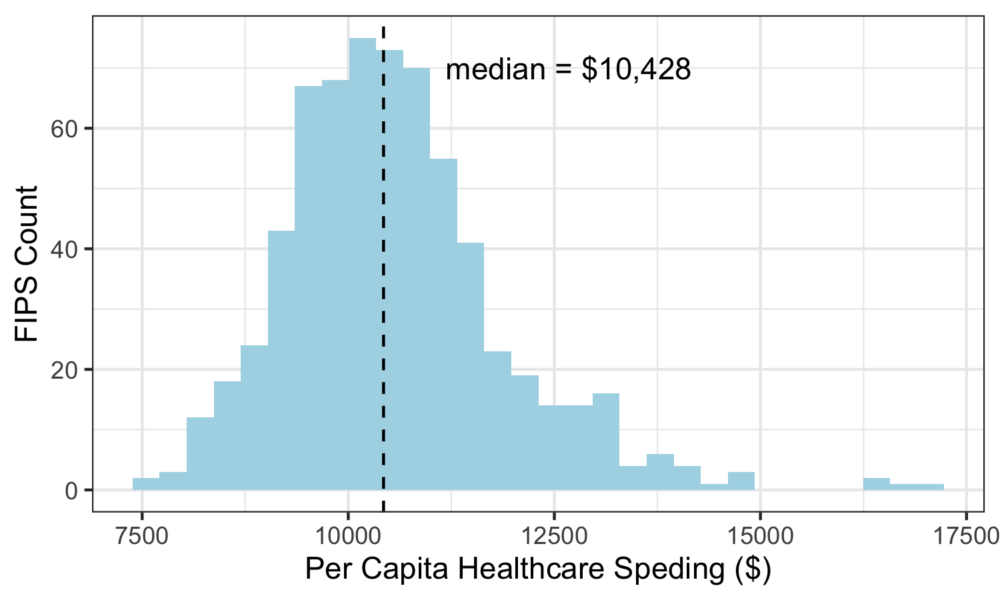
```

**Table \@ref(tab:top-5-spenders-per-capita-data)** shows the FIPS that spend the most on healthcare per capita: Baltimore, MD; Miami-Dade, FL; Los Angeles, CA; Washington, LA; Essex, NJ. **Table \@ref(tab:bottom-5-spenders-per-capita-data)** displays the FIPS that spend the least per capita on healthcare: Delta, CO; Santa Fe, NM; Tioga, PA; Mesa, CO; Outagamie, WI.

```{r top-5-spenders-per-capita-data, message = FALSE, echo = FALSE}
read_csv('../results/top-5-spenders-per-capita-data.csv') %>%
  kable(format = 'latex',
        row.names = NA,
        booktabs = TRUE,
        col.names = c('FIPS', 'Per Capita Spending (USD)'),
        caption = 'FIPS with Highest Per Capita Health Cost') %>%
  kable_styling(position = 'center') %>%
  kable_styling(latex_options = 'HOLD_position')
```

```{r bottom-5-spenders-per-capita-data, message = FALSE, echo = FALSE}
read_csv('../results/bottom-5-spenders-per-capita-data.csv') %>%
  kable(format = 'latex',
        row.names = NA,
        booktabs = TRUE,
        col.names = c('FIPS', 'Per Capita Spending (USD)'),
        caption = 'FIPS with Lowest Per Capita Health Cost') %>%
  kable_styling(position = 'center') %>%
  kable_styling(latex_options = 'HOLD_position')
```

### Features

**Figure \@ref(fig:corr-plot)** examines the correlation among our explanatory variables. Correlation among variables varies widely, however, none of the explanatory variables are negatively correlated to any other.

```{r corr-plot, out.width = '100%', fig.cap = 'Explanatory Variables Correlation Plot', fig.align = 'center', echo = FALSE}
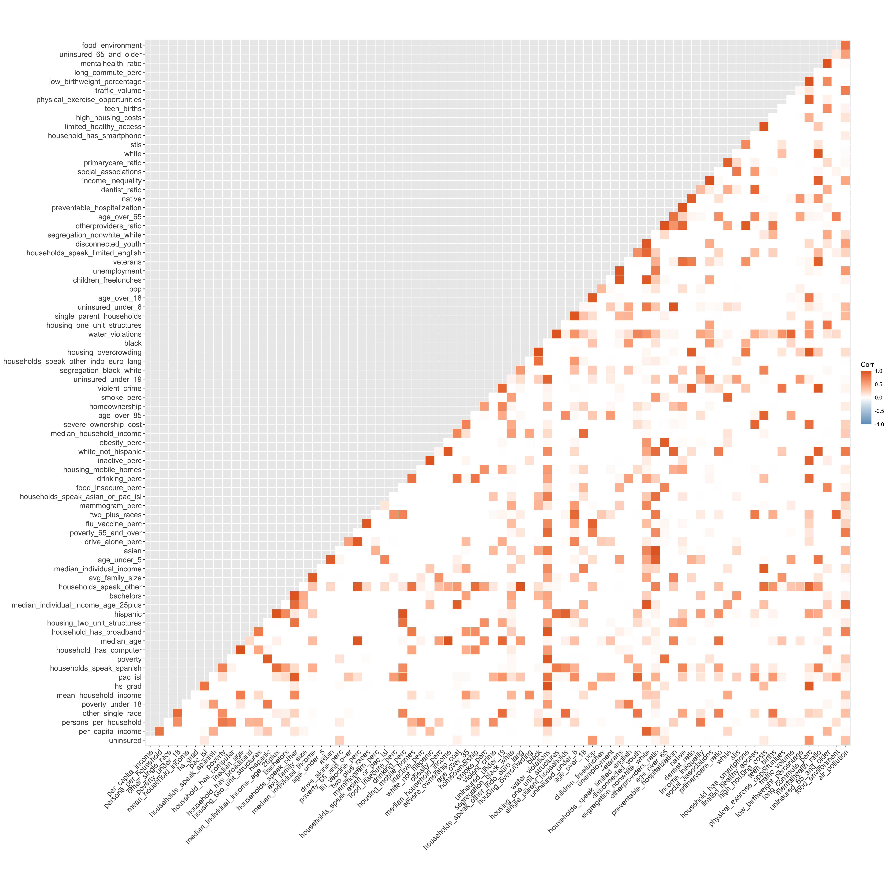
```

**Figure \@ref(fig:cost-per-capita-party-boxplot)** frames the distribution of `per capita health cost` according to political party. Counties who supported the democrat nominee for the 2020 presidential election have a higher cost of healthcare per capita on average. The analysis below will attempt to explain why.
```{r cost-per-capita-party-boxplot, out.width = '90%', fig.cap = 'Per Capita Health Cost Distrubution By Political Party.', fig.align = 'center', echo = FALSE}
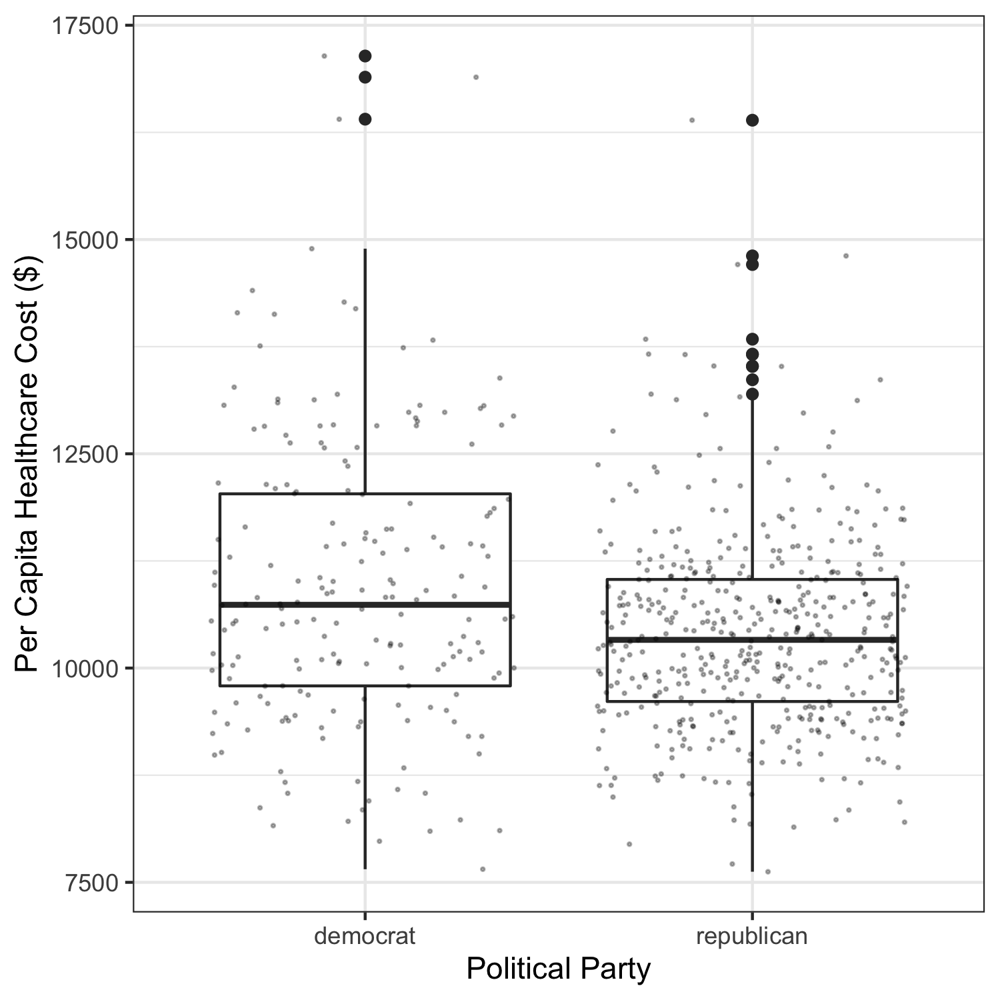
```

# Modeling

## Regression-based methods

### Ordinary least squares

Given **Figure \@ref(fig:OLS-normality-check)**  is roughly normal, a linear regression of `per capita health cost` was run on all 80 explanatory variables. The following variables were significantly associated with the response at the 0.05 level:

  - `children_freelunches`
  - `housing_overcrowding`
  - `homeownership`
  - `obesity_pct`
  - `partyrepublican`
  - `hispanic`
  - `household_has_computer`
  - `housing_mobile_homes`
  - `per_capita_income`
  - `poverty`
  - `poverty_65_and_older`
  
See the entire summary statistics in **Appendix.**

```{r OLS-normality-check, out.width = '75%', fig.cap = 'Linear Regression Residuals Plot.', fig.align ='center', echo = FALSE}
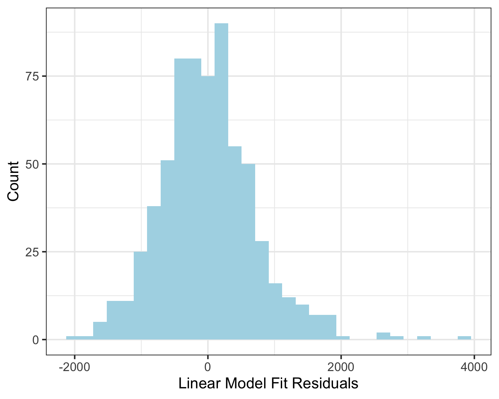
```

### Penalized regression

Although the ordinary least squares method worked well, fitting a linear model with eighty explanatory variables may lead to suboptimal predictions given the high variance cost. Aiming to better optimize our models, two cross-validated regressions, where optimal values of lambda were chosen according to the one-standard-error rule, were run: ridge and least absolute shrinkage and selection operator (LASSO).

The ridge trace plot is shown in **Figure \@ref(fig:ridge-trace-plot).** The following features were selected:

  - `high_housing_cost`
  - `preventable_hospitalization`
  - `inactive_perc`
  - `pop`
  - `long_commute_perc`
  - `housing_one_unit_structures`

```{r ridge-trace-plot, out.width = '75%', fig.cap = 'Ridge trace plot.', fig.align = 'center', echo = FALSE}
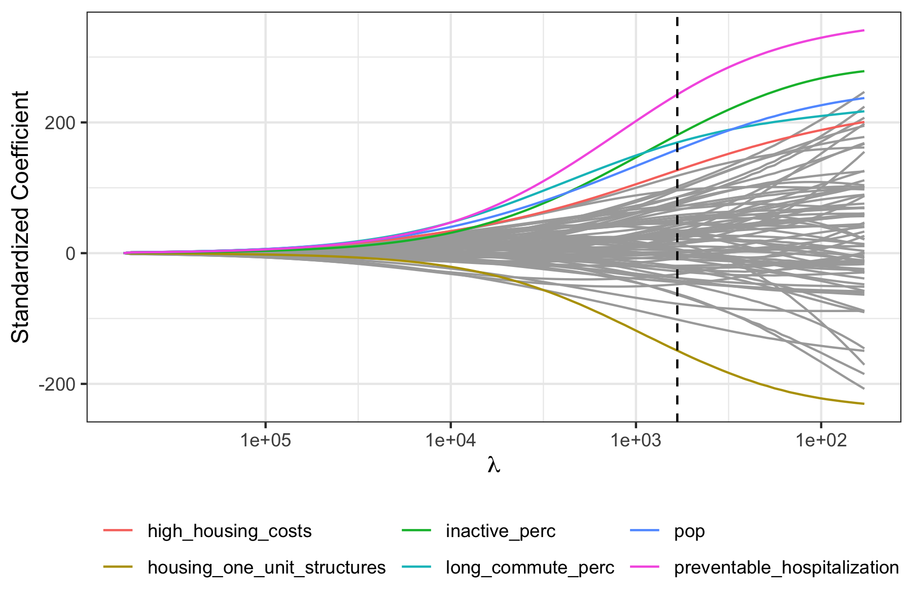
```

For lasso, **Figure \@ref(fig:lasso-CV-plot)** shows the CV plot, **Figure \@ref(fig:lasso-trace-plot)** shows the trace plot, and **Table \@ref(tab:lasso-coefficients)** shows the selected features and their coefficients.

```{r lasso-CV-plot, out.width = '75%', fig.cap = 'Lasso CV plot.', fig.align = 'center', echo = FALSE}
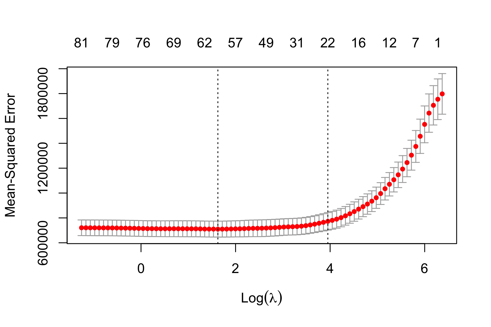
```

```{r lasso-trace-plot, out.width = '75%', fig.cap = 'Lasso trace plot.', fig.align ='center', echo = FALSE}
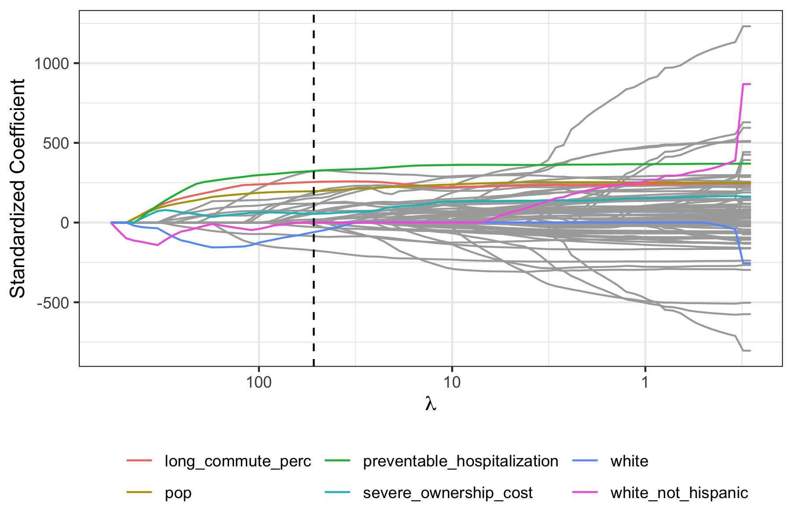
```

```{r lasso-coefficients, message = FALSE, echo = FALSE}
read_tsv('../results/lasso-features-table.tsv') %>%
  kable(format = 'latex', row.names = NA, 
        booktabs = TRUE, digits = 2, 
        col.names = c('Feature', 'Coefficient'),
        caption = 'Standardized coefficients for features in the lasso 
        model based on the one-standard-error rule.') %>%
  kable_styling(position = 'center') %>%
  kable_styling(latex_options = 'HOLD_position')
```

If lambda is chosen according to the one-standard-error rule, six features are selected:

  - `long_commute_perc`
  - `preventable_hospitalization`
  - `white`
  - `pop`
  - `severe_ownership_cost`
  - `white_not_hispanic`

## Tree-based methods

### Random forest

Tuning the random forest model on all different possible values of m, the optimal number of features to consider at each tree split, we found the optimal value of m to be 36, as seen in **Figure \@ref(fig:oob-error-plot).** 

```{r oob-error-plot, out.width = '50%', fig.cap = 'Out of Bag Error Plot.', fig.align ='center', echo = FALSE}
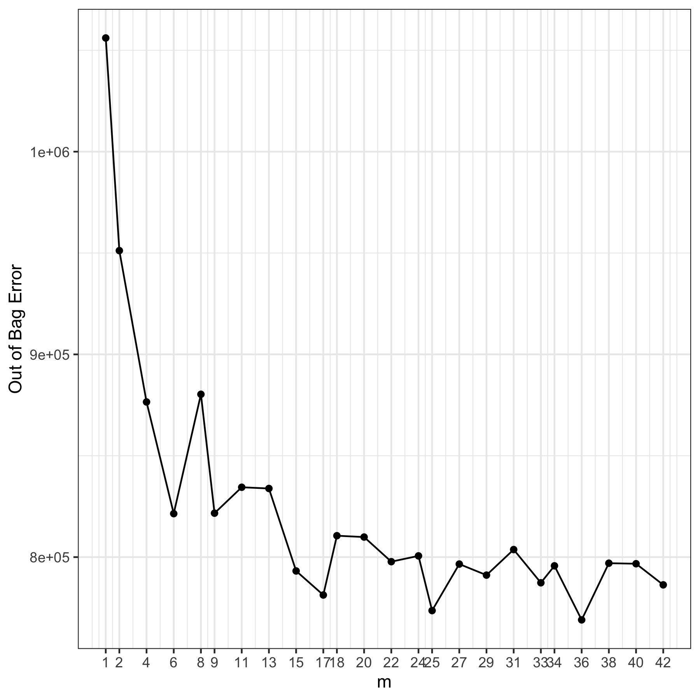
```

**Figure \@ref(fig:m-random-forest-plot)** shows the cross-validated training error sharply decreases as the number of trees increases prior to plateauing around *B* = 250, where *B* corresponds to the number of fitted trees.

```{r m-random-forest-plot, out.width = '70%', fig.cap = 'Optimal m CV Error Plot.', fig.align ='center', echo = FALSE}
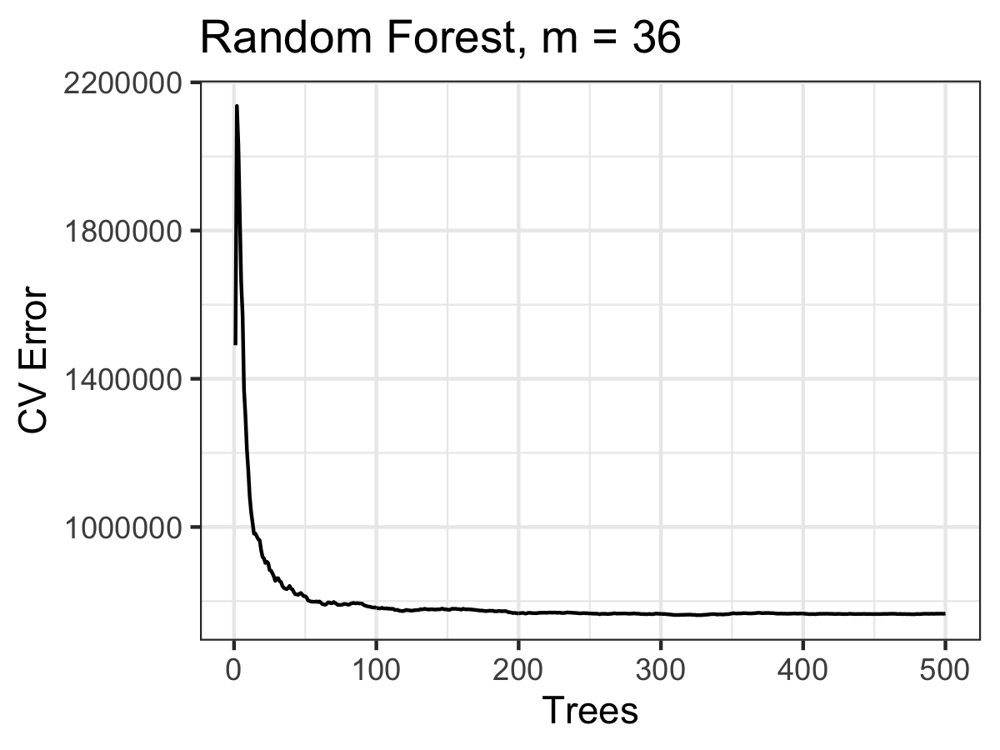
```

Examining variable importance in our random forest model, we generated **Figure \@ref(fig:variable-importance-plot).** Out of Bag variable importance estimates by permutation how influential the predictor variables in the model are at predicting the response. Purity based importance is a measure of the degree of improvement in node purity that results from splitting on a given feature.

```{r variable-importance-plot, out.width = '50%', fig.cap = 'Random Forest Importance Plot.', fig.align ='center', echo = FALSE}
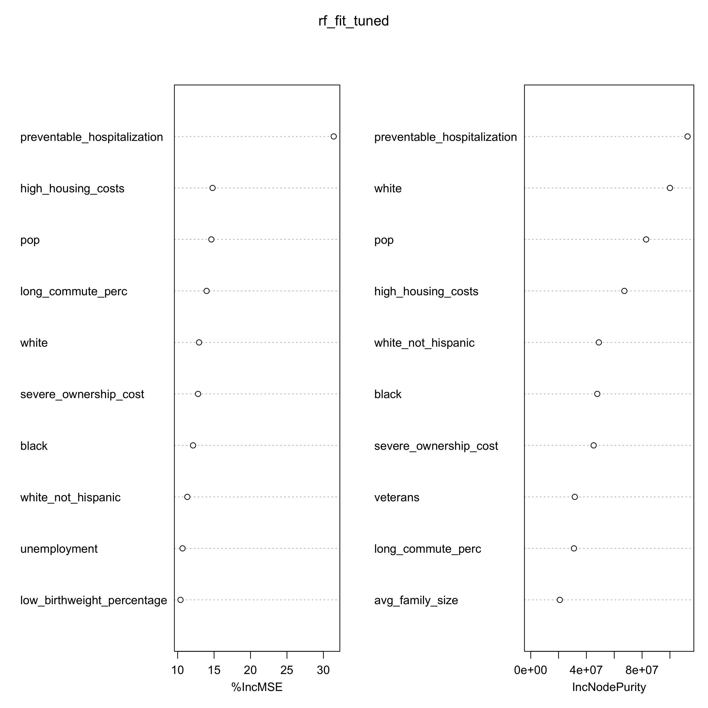
```

### Boosting

Starting with default parameters of 1000 trees, shrinkage factor = 0.1,  interaction depth = 1, and a subsampling fraction of 0.5, we then tuned our boosted model. From **Figure \@ref(fig:boosting-cv-errors-plot) we see that the optimal interaction depth is 2 given this depth attains the miniumum cross-validated error. The optimal number of trees is 246.

```{r boosting-cv-errors-plot, out.width = '50%', fig.cap = 'Plot of CV errors against the number of trees for each interaction depth.', fig.align ='center', echo = FALSE}
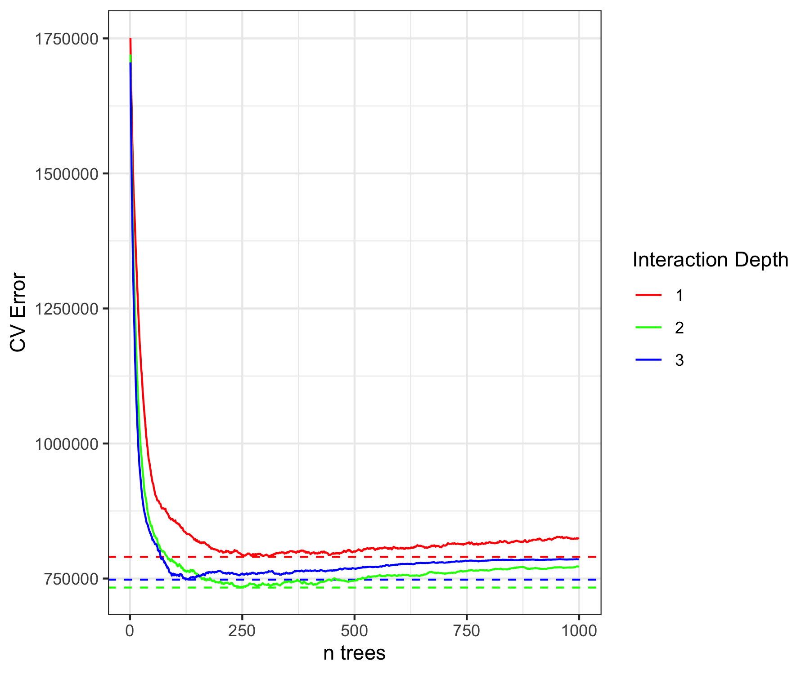
```

From **Table \@ref(tab:relative-influence-table)** we see the top ten features. 

```{r relative-influence-table, message = FALSE, echo = FALSE}
read_tsv('../results/relative-influence-table.tsv') %>%
  kable(format = 'latex', row.names = NA, 
        booktabs = TRUE, digits = 2, 
        col.names = c('Variable', 'Relative Influencce'),
        caption = 'Optimal Boosting Model Relative Influence.') %>%
  kable_styling(position = 'center') %>%
  kable_styling(latex_options = 'HOLD_position')
```

# Conclusions

## Method Comparison

Test root-mean-standard prediction errors (RMSE) for all methods considered are shown in **Table \@ref(tab:model-evaluation)**.

```{r model-evaluation, message = FALSE, echo = FALSE}
read_tsv('../results/model-evaluation.tsv') %>%
  kable(format = 'latex', row.names = NA, 
        booktabs = TRUE, digits = 2, 
        col.names = c('Model', 'Test RMSE'),
        caption = 'Root-mean-squared prediction errors.') %>%
  kable_styling(position = 'center') %>%
  kable_styling(latex_options = 'HOLD_position')
```

Ordinary least squares had the lowest test RMSE, followed by boosting and random forest. All three of these methods have high predictive accuracy. Ridge and LASSO, however, were not far off either. Regardless of differences in test RMSE, the majority of methods overlap in their identification of:

  - `long_commute_perc`
  - `preventable_hospitalization`
  - `pop`
  - `severe_ownership_cost`
  - `white_not_hispanic`

as variables of importance.

## Takeaways

Policy makers, insurance companies, and individuals stand to benefit from our analysis. Our results point to key determinants of health costs. Namely, `long_commute_perc`, `severe_ownership_cost`, and `preventable_hospitalization`. These variables identified across the various regression and tree-based methods are considered robust. 

The inclusion of `white` and `white_not_hispanic` as a strong predictor in some of the models points to larger systemic issues here in the United States. Race serves as a proxy for many other variables, and consequentially, reveals not only the problems with racial discrimination in this country but also the statistical problem of confounds.

Understanding which socioeconomic variables affect individuals' healthcare spending within the medicare-fee-for-service population will help inform individuals' personal financial decisions when choosing an appropriate healthcare plan. Accurate predictive models are also critical to efficiently target government relief and aid programs centered on this population. Knowing that someone who lives in a county with a large percentage of the population enduring long daily commutes or one with a high percentage of households that spend 50% or more of their household income on housing can guide policymakers' when reforming medicare legislation to ensure that those with the highest need (i.e. those with the highest healthcare-related expenses) benefit regardless of their current access to government welfare services. Knowing that someone lives in a county with a high percentage of preventable hospitalizations, however, may also result in insurance companies hiking premium's in that area given the county's higher cost of care per capita. Whether or not it is ethical to charge someone more for an essential service simply because of the neighborhood they live in remains a question to be answered and is beyond the scope of this report.

## Limitations

### Dataset limitations

Given both the CMS and UW dataset contain measures more than two years old, it is possible that on account of COVID-19 and other changes, this data does not accurately reflect the current make-up of county socioeconomic factors corresponding to our per capita health cost figures, which may have also been affected by the pandemic. Correlation among our explanatory variables suggests that some of these variables may have been confounds which only distorted our analysis. Only FIPS with data corresponding to all 82 variables were analyzed. Only 824 of the 3,241 possible observations by FIPS were made given the need to merge the datasets and remove any observations containing NA values. Future iterations of this study should attempt to avoid this limitation.

### Analysis limitations

Variables selected in the LASSO regression as well as variables found to be important in the tree-based methods might be misleading in that, given how variable selection works, it's possible that some selected variables are simply representative of a larger group of correlated variables. Additionally, while splitting the data into training and testing datasets allows for a more unbiased test of the models, it is possible that had a different random seed been used when splitting the data, the p-values derived in the OLS regression, the selected variables in the penalized regression methods, and the variables marked important in the tree-based methods might have been different. Our results may have been quite different had we incorporated a different set of variables too. Differences in the genetic make-up of a county's population, for example, are highly difficult to take into account. People move, family lineages are not always accurately recorded, and disease-science has really only taken hold in the last century. Our understanding of many of the key ways genetics affect health outcomes and consequently an individual's healthcare expenses is still unknown. 

## Future Directions

To build on our report, future iterations of this study ought to include data only from the current year or perhaps look at how these variables change over time within a county and affect per capita healthcare costs over an individuals lifetime. Future studies should aim to be more inclusive in their analysis of all 3,241 FIPS in the United States in order to build a more accurate predictive model. Examining data from other countries may also enhance our models and understadning.

\appendix

# Appendix {#appendix}
## Descriptions of features

  - `pop`: population.
  - `white`: percent of population that is white alone.
  - `black`: percent of population that is black alone.
  - `native`: percent of population that is Native American alone.
  - `asian`: percent of population that is Asian alone.
  - `pac_isl`: percent of population that is Native Hawaiian or other Pacific Islander alone.
  - `other_single_race`: percent of population that is some other race alone.
  - `two_plus_races`: percent of population that is two or more races.
  - `hispanic`: percent of population that identifies as Hispanic or Latino.
  - `white_not_hispanic`: percent of population that is white alone, not Hispanic or Latino.
  - `median_age`: median age.
  - `age_under_5`: percent of population under 5.
  - `age_over_85`: percent of population 85 and over.
  - `age_over_18`: percent of population 18 and over.
  - `age_over_66`: percent of population 65 and over.
  - `mean_work_travel`: mean travel time to work.
  - `persons_per_household`: persons per household.
  - `avg_family_size`: average family size.
  - `housing_one_unit_structures`: percent of housing units in 1-unit structures .
  - `housing_two_unit_structures`: percent of housing units in multi-unit structures .
  - `housing_mobile_homes`: percent of housing units in mobile homes and other types of units .
  - `median_individual_income_age_25plus`: median individual income.
  - `hs_grad`: percent of population 25 and older that is a high school graduate.
  - `bachelors`: percent of population 25 and older that earned a Bachelor's degree or higher.
  - `households`: total households.
  - `households_speak_spanish`: percent of households speaking Spanish.
  - `households_speak_other_indo_euro_lang`: percent of households speaking other Indo-European language.
  - `households_speak_asian_or_pac_isl:` percent of households speaking Asian and Pacific Island language.
  - `households_speak_other`: percent of households speaking non European or Asian/Pacific Island language.
  - `households_speak_limited_english`: percent of limited English-speaking households.
  - `poverty`: percent of population below the poverty level.
  - `poverty_under_18`: percent of population under 18 below the poverty level.
  - `poverty_65_and_over`: percent of population 65 and over below the poverty level.
  - `mean_household_income`: mean household income.
  - `per_capita_income`: per capita money income in past 12 months.
  - `median_household_income`: median household income.
  - `veterans`: percent among civilian population 18 and over that are veterans.
  - `unemployment_rate`: unemployment rate among those ages 20-64.
  - `uninsured`:percent of civilian non-institutionalized population that is uninsured.
  - `uninsured_under_6`: percent of population under 6 years that is uninsured.
  - `uninsured_under_19`: percent of population under 19 that is uninsured.
  - `uninsured_65_and_older`: percent of population 65 and older that is uninsured.
  - `household_has_computer`: percent of households that have desktop or laptop computer.
  - `household_has_smartphone`: percent of households that have smartphone.
  - `household_has_broadband`: percent of households that have broadband internet subscription.
  - `party`: political party affiliation of the winning presidential candidate in the 2020 general election.
  - `smoke_perc`: percentage of adults who are current smokers.
  - `obesity_perc`: percentage of the adult population (age 20 and older) reporting a body mass index (BMI) greater than or equal to 30 kg/m2.
  - `food_environment`: index of factors that contribute to a healthy food environment, from 0 (worst) to 10 (best).
  - `inactive_perc`: percentage of adults age 20 and over reporting no leisure-time physical activity.
  - `physical_exercise_opportunities`: percentage of population with adequate access to locations for physical activity
  - `food_insecure_perc`: percentage of population who lack adequate access to food.
  - `limited_healthy_access`: percentage of population who are low-income and do not live close to a grocery store.
  - `drinking_perc`: percentage of adults reporting binge or heavy drinking.
  - `stis`: number of newly diagnosed chlamydia cases per 100,000 population.
  - `teen_births`: number of births per 1,000 female population ages 15-19.
  - `low_birthweight_percentage`: percentage of live births with low birthweight (< 2,500 grams).
  - `primarycare_ratio`: ratio of population to primary care physicians.
  - `dentist_ratio`: ratio of population to dentists. 
  - `mentalhealth_ratio`: ratio of population to mental health providers.
  - `otherproviders_ratio`: ratio of population to primary care providers other than physicians.
  - `preventable_hospitalization`: rate of hospital stays for ambulatory-care sensitive conditions per 100,000 Medicare enrollees.
  - `mammogram_perc`: percentage of female Medicare enrollees ages 65-74 that received an annual mammography screening.
  - `flu_vaccine_perc`: percentage of fee-for-service (FFS) Medicare enrollees that had an annual flu vaccination.
  - `disconnected_youth`: percentage of teens and young adults ages 16-19 who are neither working nor in school.
  - `unemployment`: percentage of population ages 16 and older who are unemployed but seeking work.
  - `income_inequality`: ratio of household income at the 80th percentile to income at the 20th percentile.
  - `children_freelunches`: percentage of children enrolled in public schools that are eligible for free or reduced price lunch.
  - `single_parent_households`: percentage of children that live in a household headed by a single parent.
  - `social_associations`: number of membership associations per 10,000 residents. 
  - `segregation_black_white`: index of dissimilarity where higher values indicate greater residential segregation between Black and White county residents.
  - `segregation_nonwhite_white`: index of dissimilarity where higher values indicate greater residential segregation between non-White and White county residents.
  - `violent_crime` number of reported violent crime offenses per 100,000 residents. 
  - `air_pollution`: average daily density of fine particulate matter in micrograms per cubic meter (PM2.5).
  - `water_violations`: indicator of the presence of health-related drinking water violations. 1 indicates the presence of a violation, 0 indicates no violation.
  - `housing_overcrowding`: percentage of households with overcrowding, 
  - `high_housing_costs`: percentage of households with high housing costs
  - `driving_alone_perc`: percentage of the workforce that drives alone to work.
  - `long_commute_perc`: among workers who commute in their car alone, the percentage that commute more than 30 minutes.
  - `traffic_volume`: average traffic volume per meter of major roadways in the county.
  - `homeownership`: percentage of occupied housing units that are owned.
  - `severe_ownership_cost`: percentage of households that spend 50% or more of their household income on housing.

\newpage

## Linear regression summary statistics

```{r OLS-summary-stats, out.width = '35%', fig.cap = 'Linear Regression Summary Statistics', fig.align = 'center', echo = FALSE}
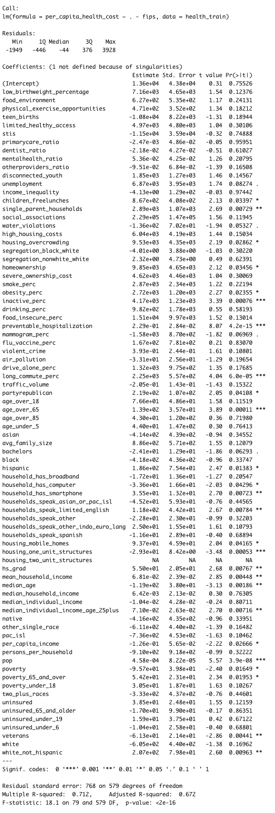
```
